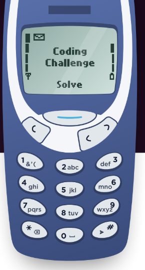

# Iron Coding Challenge

## Challenge



Here is an old phone keypad with alphabetical letters, a
backspace key, and a send

button.

Each button has a number to identify it and pressing a button
multiple times will

cycle through the letters on it allowing

each button to represent more than one letter.

For example, pressing 2 once will return ‘A’ but pressing twice
in succession will return
‘B’.

You must pause for a second in order to type two characters from the same
button

after each other: “222 2 22” -> “CAB”.

**Assume that a send “#” will always be included at the end of every input.**

```
public static string OldPhonePad(string input)
{

}
```

### Examples:

OldPhonePad(“33#”) => output: E

OldPhonePad(“227\*#”) => output: B

OldPhonePad(“4433555 555666#”) => output: HELLO

OldPhonePad(“8 88777444666\*664#”) => output: ?????

## Approach

1. Create a dictionary to store the keypads and their respective letters. I used dictionary instead of array because it is easier to read, access and faster than iterate an array.

2. I created 4 variables:

   - Store the current pressed button ("currentGroup").
   - Store the previous pressed button ("lastGroup").
   - A counter, to store consecutive same buttons ("counter").
   - A variable to store my final output ("output").

3. I iterated over my input string, with the goal of checking each button pressed and whether it was a repeated one or not.

4. Handle unexpected buttons, by jumping to the another iteration and handle backspace button, by removing the latest letter of my output.

5. If a button was a repeated one or was the first button pressed, I increment the counter. Otherwise, I check if the counter is higher than the numbers of letter of my current pressed button, handling with cases that the user can press, for example: "2222", so I need to "reset" my letters, taking the division modulus of the number of letters in the current pressed button. Then, I add the "transformed" letter to my output string, restart my counter to 1 and update my last pressed to button.

## Test cases

```
Input: ""
Expected output: ""

Input: "****"
Expected output: ""

Input: "#"
Expected output: ""

Input: "     #"
Expected output: ""

Input: "8 88777444666*664#"
Expected output: "TURING"

Input: "  22 7 * #"
Expected output: "B"

Input: ""22******77#"
Expected output: "Q"
```
